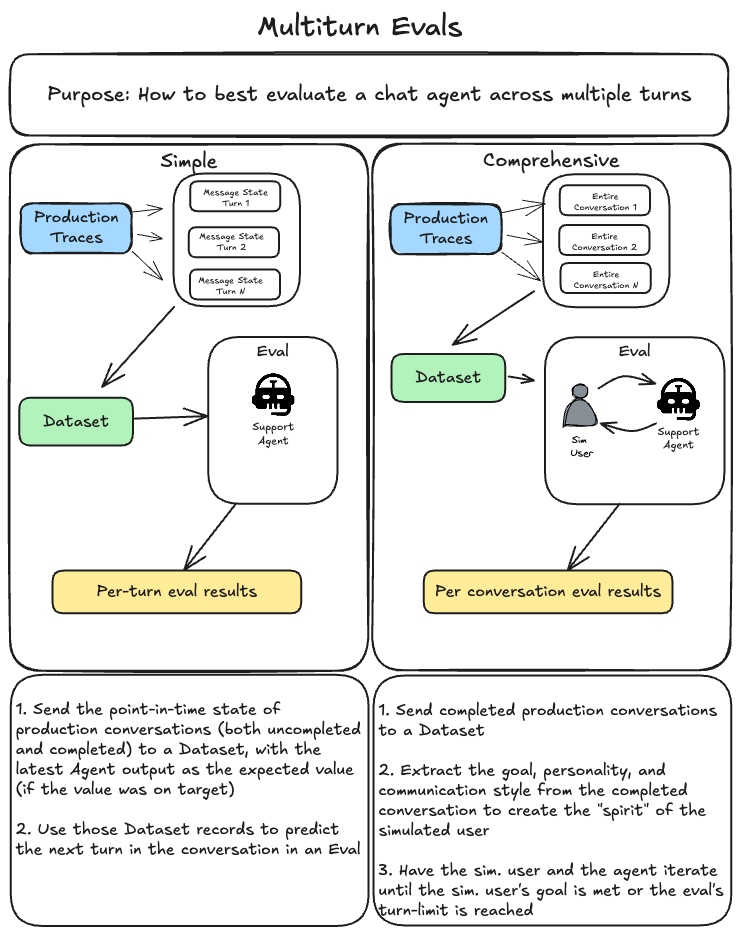

# l8r Customer Service Chatbot

A Next.js customer service chatbot for the fictional "l8r" buy-now-pay-later service, with comprehensive evaluation capabilities using Braintrust.

## Prerequisites

- Node.js 18+
- npm
- OpenAI API key
- Braintrust API key

## Setup

### 1. Install dependencies

```bash
npm install
```

### 2. Configure environment variables

Copy the example environment file and add your API keys:

```bash
cp .env.example .env
```

Edit `.env` with your actual keys:

```
DATABASE_URL="file:./dev.db"
OPENAI_API_KEY=sk-...
BRAINTRUST_API_KEY=bt-...
```

### 3. Initialize the database

The app uses SQLite with Prisma. Initialize and seed the database:

```bash
npm run db:reset
```

This will:
- Create the SQLite database at `prisma/dev.db`
- Apply the schema (Users, Orders, InstallmentPlans, Payments, RefundRequests)
- Seed with sample customer data

## Running the App

Start the development server:

```bash
npm run dev
```

Open [http://localhost:3000](http://localhost:3000) to interact with the chatbot.

---

## Evaluations

This project includes two evaluation approaches for testing the chatbot across multi-turn conversations:



### Understanding Multi-turn Evaluation Approaches

| Approach | Best For | How It Works |
|----------|----------|--------------|
| **Simple (Next-Turn)** | Regression testing, fast iteration | Takes conversation snapshots and predicts the next turn |
| **Comprehensive (Simulation)** | End-to-end testing, realistic scenarios | Simulates complete conversations with AI-generated users |

---

### 1. Next-Turn Evaluation (`conversation.eval.ts`)

Tests the agent's ability to produce the correct next response given a conversation history.

**When to use:**
- Fast regression testing during development
- Validating specific conversation patterns
- Testing tool call behavior

**Run the eval:**

```bash
npx braintrust eval evals/conversation.eval.ts
```

**What it evaluates:**
- **ToolCallCheck** - Did the agent call the expected tools?
- **StructureCheck** - Is the response well-formatted for customer service?
- **HelpfulnessCheck** - Does the response address the customer's needs?

**Data source:** Uses the `L8rCustomerServiceDataset` from Braintrust, which contains conversation snapshots at various points.

---

### 2. Simulated Conversation Evaluation (`sim.eval.ts`)

Runs complete multi-turn conversations between a simulated user and the agent.

**When to use:**
- End-to-end conversation testing
- Testing conversation flow and resolution
- Evaluating how well the agent achieves user goals

**Run the eval:**

```bash
npx braintrust eval evals/sim.eval.ts
```

**How it works:**

1. **Profile Extraction** - Extracts the user's goal, personality, and communication style from a seed conversation
2. **Conversation Loop** - The simulated user and agent exchange messages until:
   - The user is satisfied (goal achieved)
   - The user is frustrated (agent unhelpful)
   - Max turns reached (10 turns)
3. **Scoring** - Evaluates the entire conversation

**User Personalities:**
- `direct` - Brief, to-the-point, ends conversation promptly
- `exploratory` - Asks follow-up questions, explores related topics
- `frustrated` - Impatient, expresses dissatisfaction if not helped quickly
- `friendly` - Polite, appreciative, engages in pleasantries
- `confused` - Needs extra clarification, uncertain

**What it evaluates:**
- **ResolutionCheck** - Did the agent handle the conversation appropriately?
- **GoalAchievement** - Did the agent help achieve the user's goal (or correctly redirect off-topic requests)?
- **QualityCheck** - Was the conversation professional and coherent?
- **EfficiencyCheck** - How many turns did it take to resolve?

**Data source:** Uses the same `L8rCustomerServiceDataset`, treating each entry as a seed for generating a simulated user.

---

## Customizing Evaluations

Both evals support a `instructions` parameter to test different system prompts via [remote evals](https://www.braintrust.dev/docs/evaluate/remote-evals#run-remote-evaluations):

```bash
npx braintrust eval evals/sim.eval.ts --dev'
```

### Hosting the remote eval dev server (Modal)

This repo includes `deploy/modal_eval_server.py`, which starts Braintrust's eval dev server for the TypeScript evals and exposes it as an HTTPS endpoint on Modal.

**Prereqs:**
- Install Modal locally (`pip install modal`) and authenticate (`modal setup`)
- Ensure your `.env` contains `BRAINTRUST_API_KEY` `OPENAI_API_KEY`

**Deploy:**

```bash
modal deploy deploy/modal_eval_server.py
```

## Database Commands

| Command | Description |
|---------|-------------|
| `npm run db:push` | Push schema changes to database |
| `npm run db:seed` | Seed database with sample data |
| `npm run db:reset` | Reset database and reseed (destructive) |

## Project Structure

```
├── src/
│   ├── app/              # Next.js app router
│   │   └── api/chat/     # Chat API endpoint (streaming)
│   └── lib/
│       ├── chatbot/      # Chat logic, tools, system prompt
│       └── braintrust.ts # Braintrust tracing setup
├── evals/
│   ├── conversation.eval.ts  # Next-turn evaluation
│   └── sim.eval.ts           # Simulated conversation evaluation
├── prisma/
│   ├── schema.prisma     # Database schema
│   └── seed.ts           # Database seeding script
└── assets/
    └── Multiturn.png     # Evaluation approach diagram
```
